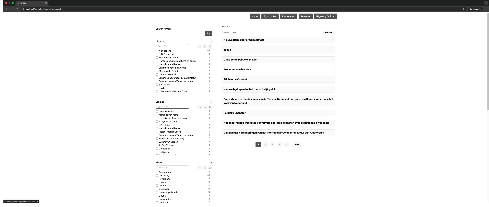

# Bataafse politieke tijdschriften

## Procrustus, Panoptes API and Panoptes Browser

The penultimate triple of projects to get you started with a generic browser.

## Main flow

In a nutshell, the main flow is as follows:

- Take the input data and transform this in some way to a suitable input format: for now, this will be JSON.
- Create a configuration for the Procrustus indexer to read and index your converted data into ElasticSearch indexes (mapping A).
- Read and index your converted data in ElasticSearch.
- Create configuration for Panoptes to map ElasticSearch indexes to a suitable format for the Panoptes API to serve to the generic browser (mapping B).
- Read this configuration into MongoDB and have Panoptes serve the data to the Panoptes generic browser.

# Procrustus indexer configuration — Mapping A

Procrustus attempts to convert input data into a suitable format for (ElasticSearch) indexing, by converting input JSON files into a collection of output JSON files, 
where properties in the input are mapped onto desired properties in the output. This allows flattening of complex, nested objects into more
manageable data structures. After this conversion, the indexer reads the created output JSON files and imports them into ElasticSearch.

The configuration for Procrustus read and index is specified in a TOML file where the mapping from input to output is defined. This file also steers the needed
elements for proper ElasticSearch index creation.

See https://github.com/knaw-huc/procrustus-indexer?tab=readme-ov-file#toml-configuration for more information on read and index configuration.


# Panoptes MongoDB configuration - Mapping B

Panoptes acts as a backend for a generic collection browser and contains configuration for the mapping of ElasticSearch indexes to Panoptes API structures.

Panoptes is setup to act in a multi-tenant setup with a single Panoptes API instance serving multiple browsers for accessing multiple datasets.

The configuration for the tenants and datasets in Panoptes is managed in MongoDB. In order to configure this, you need to have at least two databases: one named main and one with the name of your tenant.

## Custom MongoDB image

Rather than using the stock `mongo:latest` image, this project builds a custom MongoDB image (`registry.diginfra.net/tsd/hi-bataafse-politieke-tijdschriften-mongo:latest`) via `Dockerfile.mongo`. It extends the official image by copying the seed scripts from `seed/mongo/` into `/docker-entrypoint-initdb.d/`, so the database is automatically seeded with the required Panoptes tenant and dataset configuration on first start:

- `001-main-tenants.js` — creates the `main` database tenants
- `002-tenant-datasets.js` — configures the tenant datasets
- `003-tenant-detail-properties.js` — sets detail properties
- `004-tenant-facets-and-result-properties.js` — sets facets and result properties
- `005-tenant-schema-properties.js` — sets schema properties

The mongo image is built alongside the indexer image via `docker buildx bake`.

# Docker Compose

Two Docker Compose files are provided depending on the deployment target.

## `docker-compose.yml` — development

The default Docker Compose setup is mainly aimed at development. This spins up an ElasticSearch, a MongoDB and the Panoptes API.

You can verify the existence of indexes in ElasticSearch by visiting: http://localhost:9200/_cat/indices?format=json

# Getting started with this setup

To get started with this particular setup, you can run the Docker Compose file to start up a:

- ElasticSearch
- MongoDB
- Panoptes API (with schema additions)
- Panoptes browser (with schema additions)
- A one-shot indexer image that indexes the Excel data in ElasticSearch (executing this is tied to a Docker profile).

## Running the indexer

The indexer reads the Excel data, converts it to JSON, and indexes it into ElasticSearch via Procrustus. It can be run in two ways:

### Option 1: Docker Compose (recommended)

The Docker Compose file includes an `indexer` service under the `indexer` profile. Run it alongside the core services with:

```docker compose --profile indexer up```

The indexer container connects to ElasticSearch using the `ES_HOST` and `ES_PORT` environment variables (defaulting to `elastic` and `9200` within the Docker network).

### Option 2: Run locally

You can also run the indexer script directly. It will connect to ElasticSearch using the `ES_HOST` and `ES_PORT` environment variables (defaulting to `localhost` and `9200`):

```poetry run python read_and_index.py Database-Bataafse-Politieke-Tijdschriften.xlsx```

To target a non-default ElasticSearch host:

```ES_HOST=myhost ES_PORT=9201 poetry run python read_and_index.py Database-Bataafse-Politieke-Tijdschriften.xlsx```

## Building the indexer and mongo images

A `Dockerfile.indexer`, `Dockerfile.mongo`, and a `docker-bake.hcl` are provided to build both images. To build for both `linux/amd64` and `linux/arm64`:

```docker buildx bake```

The default image tags are:
- `registry.diginfra.net/tsd/hi-bataafse-politieke-tijdschriften-indexer:latest`
- `registry.diginfra.net/tsd/hi-bataafse-politieke-tijdschriften-mongo:latest`

Override the registry, image name, or tag with the `REGISTRY`, `IMAGE_NAME`, `MONGO_IMAGE_NAME`, and `TAG` variables:

```REGISTRY=myregistry TAG=v1.0 docker buildx bake```

## `portainer-template-docker-compose.yml` — Portainer deployments

A separate Compose file is provided for deploying via [Portainer](https://www.portainer.io/). Key differences from the development file:

- Uses the custom mongo image (`registry.diginfra.net/tsd/hi-bataafse-politieke-tijdschriften-mongo:latest`) — same as development.
- Uses external named volumes (`es-data`, `mongo-data`) and an external `traefik-public` network, which are expected to exist in the target environment.
- Exposes services via Traefik labels (using `$TRAEFIK_*` variables) rather than publishing ports directly.
- Uses `expose` instead of `ports` for all services.
- `VITE_PANOPTES_URL` is driven by the `$PANOPTES_URL` environment variable.

### Prerequisites

The following external resources must exist in the target environment before deploying:

**Volumes** (create once via Portainer or `docker volume create`):
- `es-data` — persists ElasticSearch data
- `mongo-data` — persists MongoDB data

**Network:**
- `traefik-public` — the external Traefik overlay network must exist and have Traefik attached to it

### Environment variables

Set these as Portainer stack environment variables when deploying:

| Variable | Description | Example                                                                                                  |
|---|---|----------------------------------------------------------------------------------------------------------|
| `PANOPTES_URL` | Public URL of the Panoptes API, used by the browser frontend | `bataafse-politieke-tijdschriften.dev.diginfra.net`                                                                              |
| `TRAEFIK_HOST` | Traefik `Host` rule label for the Panoptes browser | `traefik.http.routers.panoptes-browser.rule=Host(\`bataafse-politieke-tijdschriften.dev.diginfra.net\`)` |
| `TRAEFIK_ENTRYPOINTS` | Traefik entrypoints label for the Panoptes browser | `traefik.http.routers.panoptes-browser.entrypoints=http`                                                 |
| `TRAEFIK_PORT` | Traefik port label for the Panoptes browser | `traefik.http.services.panoptes-browser.loadbalancer.server.port=80`                                     |

## Verifying the indexes

After indexing, verify the ElasticSearch indexes with:

```curl http://localhost:9200/_cat/indices?format=json```

This should show you 4 indexes:

- hi-ga-tijdschriften-personen
- hi-ga-tijdschriften-uitgever_drukker
- hi-ga-tijdschriften-tijdschriften
- hi-ga-tijdschriften-plaatsnaam

You should now be able to open the Panoptes browser, by visiting the URL:

```http://localhost/politieke-tijdschriften/search```

This should give you a screen similar to:

